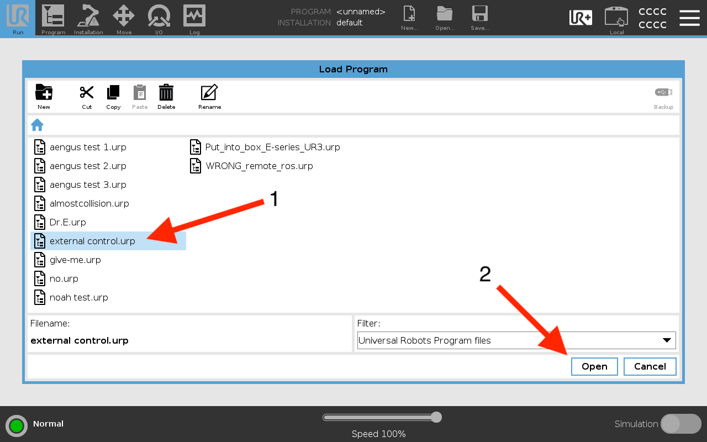
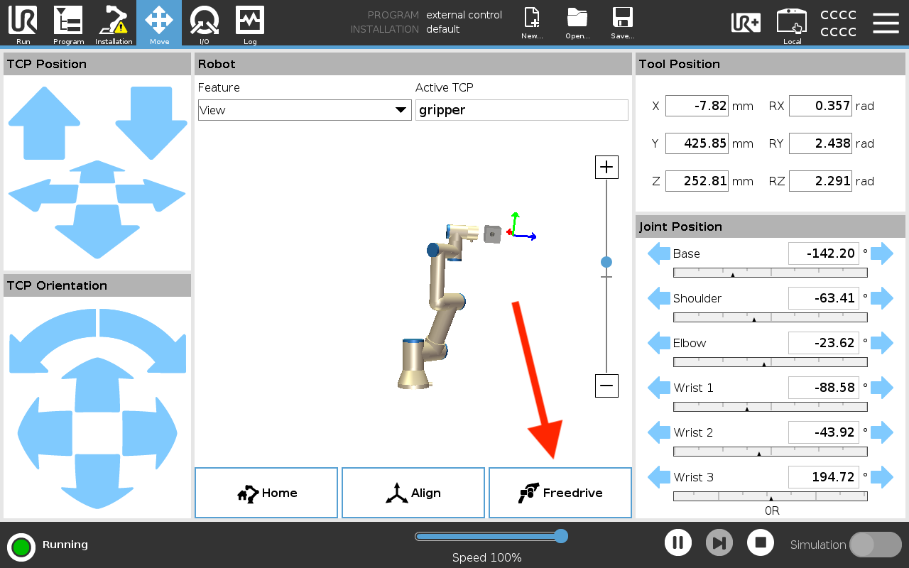

# UR Teach Pendant Tutorial
Each Universal Robot model is accompanied by a Teach Pendant; a touch screen display that interfaces with the robot. We will use the Teach Pendant to start up the robot, monitor the robot while in use, and put the robot into freedrive mode.

## Starting the Robot
1. Press the white power button to turn on the Teach Pendant.
2. Click on the red circle in the lower left hand corner of the screen.

    

3. Click "ON" to give power to the robot.

    

4. Click "START" to release the joint locks and enable the robot's motion.

    

5. Click "Exit" to return back to the home screen.

    

6. Click "Load Program."

    

7. Select the "external control.urp" program and then click "Open."

    

8. Click the big blue play button to run the program.

    

## Monitoring the Robot
While the robot arm is in use, the Teach Pendant should be in an easily accessed location. If you need to stop the robot while it is in motion, you can either:
1. Press the big red E-Stop button on the Teach Pendant. This will stop power to the robot arm, and require you to start up the robot again.
2. Press the pause button at the center of the program page on the Teach Pendant or at the bottom right hand corner of every other page.

If an error shows up on the Teach Pendant, for example "Protective Stop," follow these steps to return to operating the robot.
1. Ensure that your control program has stopped running. Use Ctrl ^C to force quit a frozen process.
2. Click "Enable Robot" on the Teach Pendant
3. Click the blue play button to resume external control.

## Using Freedrive
Freedrive is a useful tool to manually reposition the robot arm or record a trajectory. To enter freedrive mode, follow these steps.
1. Click the blue pause button to pause external control.
2. Press and hold the black tactile button the the back front of the Teach Pendant.
3. Or, navigate to the "Move" page on the Teach Pendant and click and hold the "Freedrive" button.

    
    

